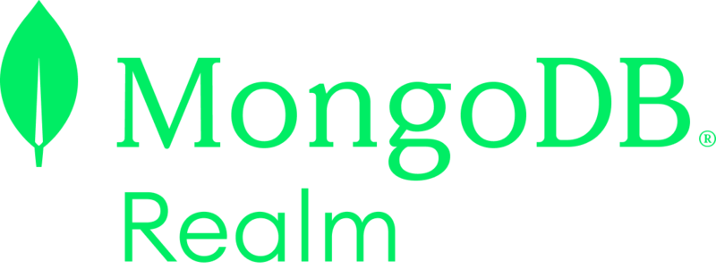
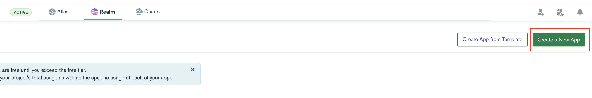
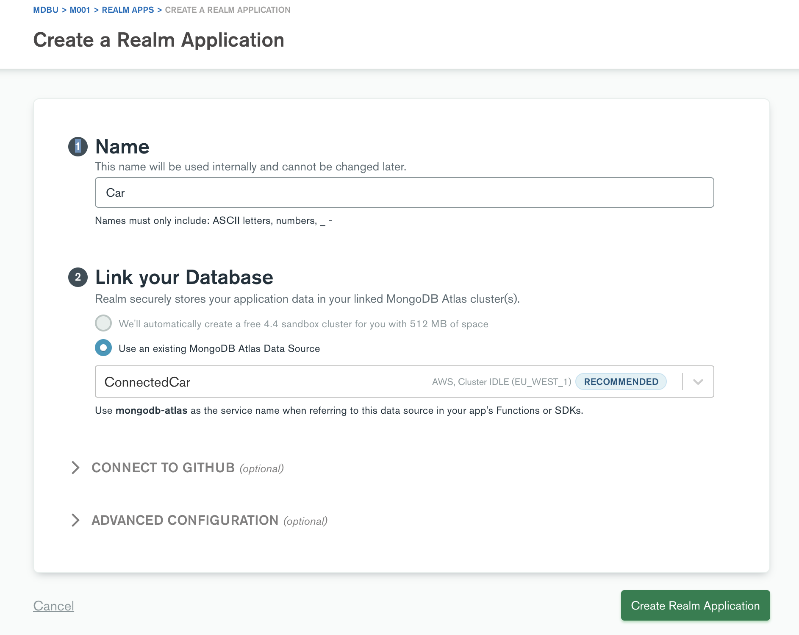
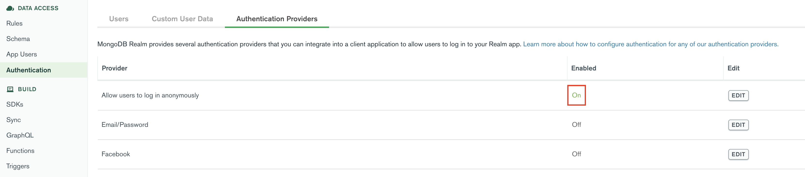
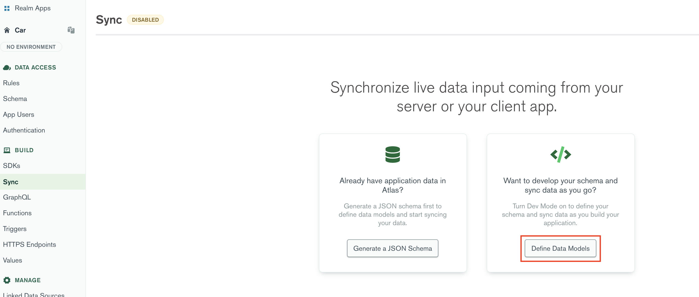
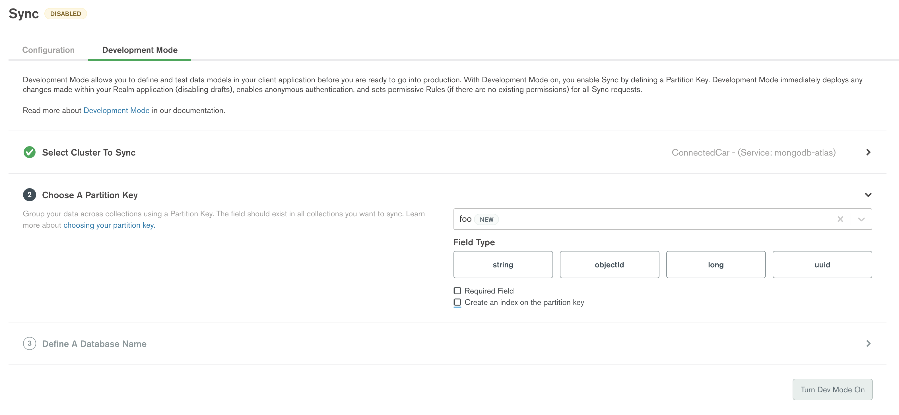
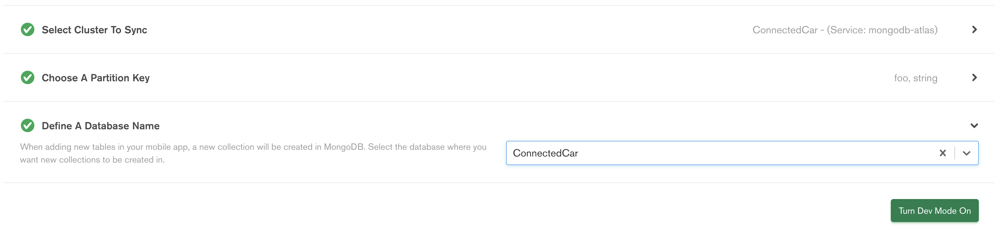
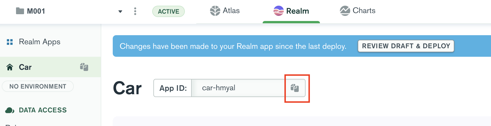

#  Controlled Car with 

This folder contains a small demo application, leveraging the MongoDB Realm (C++ SDK) with QT. It consists of two small independent applications, each using an instance of MongoDB Realm, connected via a MongoDB Atlas cluster as backend. The demo showcases how the state of a device (car, heating system...) can be updated in real time.


Before you get started, you have to fulfill some prerequisits.

## Prerequisits For MacOS / Linux

* Building Realm requires Xcode 11.x or newer
* QT Creator (OSS version is fine)
* git, cmake, cxx20

### Install Required Packages
If the packages (git, cmake and cxx20) are not already installed:

```sh
/bin/bash -c "$(curl -fsSL https://raw.githubusercontent.com/Homebrew/install/HEAD/install.sh)"
brew install git
brew install cmake
brew install cxx20 
```
### Clone GitHub Repo

Download the github repository: https://github.com/mongodb-industry-solutions/connected-products

Move into the folder and execute the following commands:

```sh
git submodule update --init --recursive
mkdir build.debug
cd build.debug
cmake -D CMAKE_BUILD_TYPE=debug ..
sudo cmake --build . --target install  
```
### Download and Install QT

Download the QT installer: https://www.qt.io/download-qt-installer

Open the installer. 

You probably have to create an account if you don't have one already.
When asked, select components as below:


## Run the Demo

Once installed, close the installer and open QT from your applications folder (else it might not ask for permission to access your folders). Then select "Projects" and "Open":


Then in the previously cloned github repository select ```examples/remotecontrolledcar/remotecontrolledcar.pro```. 

Then select the computer icon at the bottom left:


Click on the green triangle to start the car app (If it doesn't run you might have to hit the "Hammer" icon to build it first):


Do the same with the controller app.

The Controller leverages MongoDB Realm to control the Car, so both apps (controller and car) can be run independently of each other. In separate processes or on different machines around the world.
 


## Add Your Own Atlas Cluster (work in progress)

Follow the official MongoDB documentation for clusters creation: https://docs.atlas.mongodb.com/tutorial/create-new-cluster/

The cluster has been named "ConnectedCar"

Once the cluster is created create a new app from the Realm tab



We link the app to our cluster



Allow users to log in anonymously



On the left side of the page click on Sync then Define data models



Fill out the fields as shown remembering to uncheck the boxes and selecting String



Then selecting the db name



Let's now reference our app in the code:

First we need to copy the app id



In the github repository follow the path examples/remotecontrolledcar/car and open the file main.cpp, edit line 63

```cpp  
    auto realm_app = realm::App("car-wsney");
``` 
and replace "car-wsney" with the name of your app. Do the same with the main.cpp file contained in examples/remotecontrolledcar/controller

Once all of the above steps are completed, you can run both applications like explained here: [Run Demo App](https://github.com/mongodb-industry-solutions/connected-products/tree/main/examples/remotecontrolledcar#run-the-demo)

