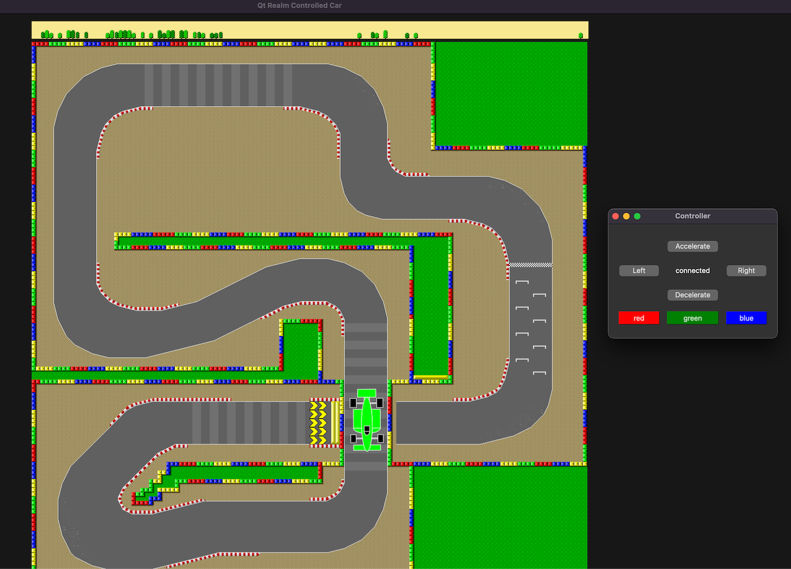
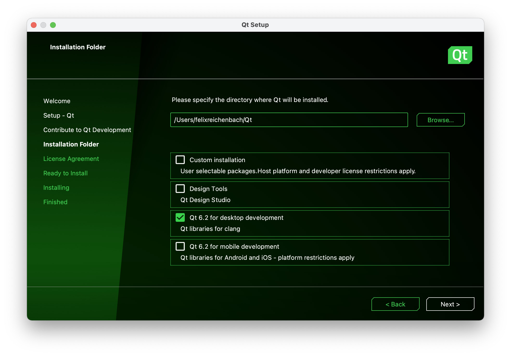
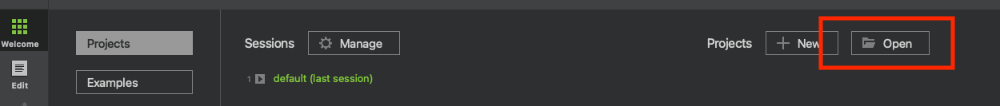
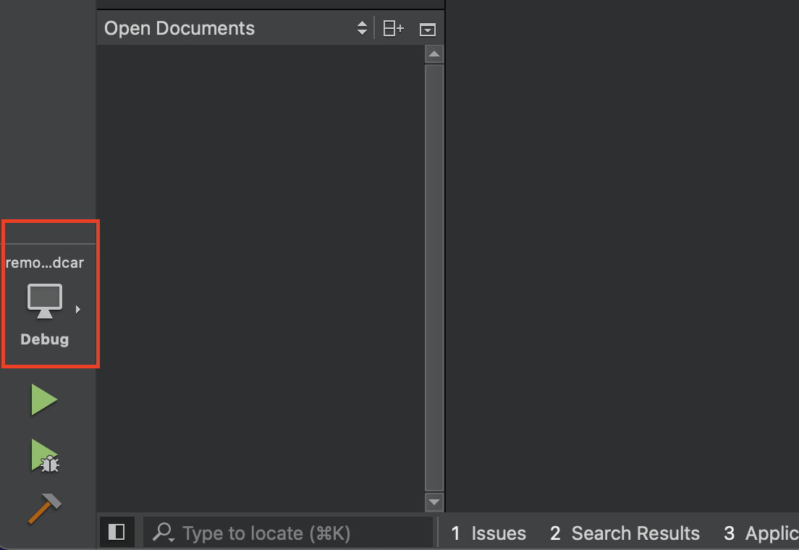
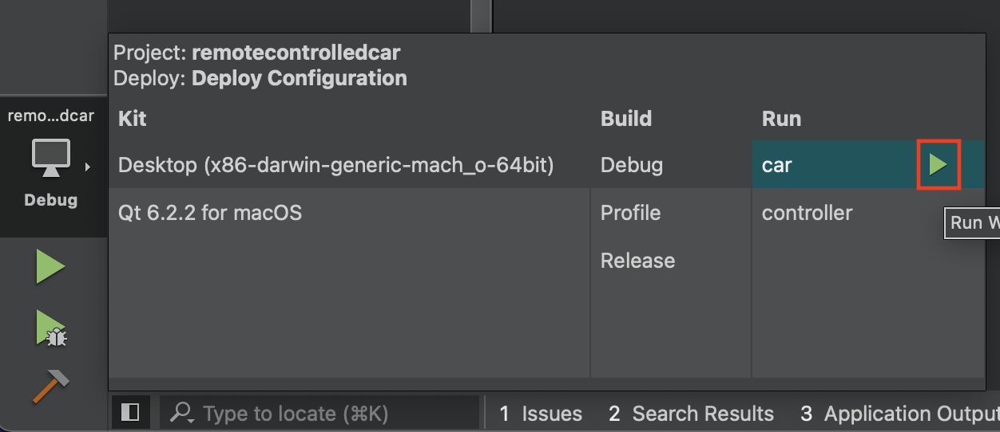

# MongoDB Realm Controlled Car with QT

This folder contains a small demo application, leveraging the MongoDB Realm (C++ SDK) with QT. It consists of two small independent applications, each using an instance of MongoDB Realm, connected via a MongoDB Atlas cluster as backend. The demo showcases how the state of a device (car, heating system...) can be updated in real time.



Before you get started, you have to fulfill some prerequisits.

## Prerequisits For MacOS / Linux

* Building Realm requires Xcode 11.x or newer
* QT Creator (OSS version is fine)
* git, cmake, cxx20

### Install Required Packages
If the packages (git, cmake and cxx20) are not already installed:

```sh
/bin/bash -c "$(curl -fsSL https://raw.githubusercontent.com/Homebrew/install/HEAD/install.sh)"
brew install git
brew install cmake
brew install cxx20 
```
### Clone GitHub Repo

Download the github repository: https://github.com/jsflax/realm-cpp-sdk

Move into the folder and execute the following commands:

```sh
git submodule update --init --recursive
mkdir build.debug
cd build.debug
cmake -D CMAKE_BUILD_TYPE=debug ..
sudo cmake --build . --target install  
```
### Download and Install QT

Download the QT installer: https://www.qt.io/download-qt-installer

Open the installer. 

You probably have to create an account if you don't have one already.
When asked, select components as below:



## Run the Demo

Once installed, Open QT and select "Projects" then Open:



Then in the previously cloned github repository select ```examples/remotecontrolledcar/remotecontrolledcar.pro```. Then select the computer icon at the bottom left:



Click on the green triangle to start the car app



Do the same with the controller app.

The Controller leverages MongoDB Realm to control the Car, so both apps (controller and car) can be run independently of each other. In separate processes or on different machines around the world.
 


